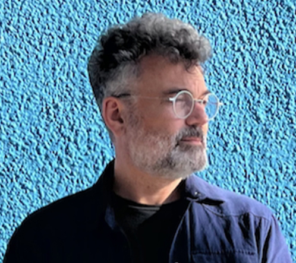

	<h4>{{ page.title }}</h4>

  

  
<b>I'm Dave Elfving, and this is where I share projects and ideas.</b> I'm a teacher, artist and Experience Designer living in San Francisco.

  
Lately, my work explores the relationship between human perception, Machine Learning and AI systems. I particurlary enjoy mashing up data, traditional darkroom photography and <a href ="https://en.wikipedia.org/wiki/Creative_coding">creative coding</a>.

  
I teach in the Interaction Design program at the <a href = "https://www.cca.edu/design/ixd/">California College of the Arts</a>, and I've served on the board of directors at <a href="http://www.firstexposures.org">First Exposures</a>, <a href = "http://www.grayarea.org">Gray Area</a>, and <a href = "http://www.sfcamerawork.org">SF Camerawork</a>. For a long time, I worked at Apple on their interactive marketing team. If you like, you can learn more about me at <a href ="https://www.linkedin.com/in/delfving/">LinkedIn</a>.

  
Also: <a href = "https://www.heliocentricAF.org">Heliocentric AF</a>.

