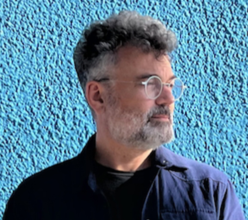

	<h4>{{ page.title }}</h4>

  

  
<b>I'm Dave Elfving, and this is where I share projects and ideas.</b> I'm a teacher, artist and Experience Designer living in San Francisco. I teach in the Interaction Design program at the <a href = "https://www.cca.edu/design/ixd/">California College of the Arts</a>, and I've served on the board of directors at <a href="http://www.firstexposures.org">First Exposures</a>, <a href = "http://www.grayarea.org">Gray Area</a>, and <a href = "http://www.sfcamerawork.org">SF Camerawork</a>. For a long time, I worked at Apple on their interactive marketing team. If you like, you can learn more about me at <a href ="https://www.linkedin.com/in/delfving/">LinkedIn</a>.

  <h2>Speaking</h2>

  
<b>My AI Co-Teacher</b> — Long Now Foundation, Ignite Talks 2023

  

    

      

        <svg viewBox="0 0 68 48" width="68" height="48" style="position:absolute; top:50%; left:50%; transform:translate(-50%,-50%);"><path d="M66.52 7.74c-.78-2.93-2.49-5.41-5.42-6.19C55.79.13 34 0 34 0S12.21.13 6.9 1.55c-2.93.78-4.63 3.26-5.42 6.19C.06 13.05 0 24 0 24s.06 10.95 1.48 16.26c.78 2.93 2.49 5.41 5.42 6.19C12.21 47.87 34 48 34 48s21.79-.13 27.1-1.55c2.93-.78 4.64-3.26 5.42-6.19C67.94 34.95 68 24 68 24s-.06-10.95-1.48-16.26z" fill="#f00"/><path d="M45 24 27 14v20z" fill="#fff"/></svg>
      

    

  

  
<b>Teaching Design with AI</b> — AI User Group, AI For Designers #26

  

    

      

        <svg viewBox="0 0 68 48" width="68" height="48" style="position:absolute; top:50%; left:50%; transform:translate(-50%,-50%);"><path d="M66.52 7.74c-.78-2.93-2.49-5.41-5.42-6.19C55.79.13 34 0 34 0S12.21.13 6.9 1.55c-2.93.78-4.63 3.26-5.42 6.19C.06 13.05 0 24 0 24s.06 10.95 1.48 16.26c.78 2.93 2.49 5.41 5.42 6.19C12.21 47.87 34 48 34 48s21.79-.13 27.1-1.55c2.93-.78 4.64-3.26 5.42-6.19C67.94 34.95 68 24 68 24s-.06-10.95-1.48-16.26z" fill="#f00"/><path d="M45 24 27 14v20z" fill="#fff"/></svg>
      

    

  

  
<b>My AI Teaching Assistant</b> — AI User Group, AI For Designers #16

  

    

      

        <svg viewBox="0 0 68 48" width="68" height="48" style="position:absolute; top:50%; left:50%; transform:translate(-50%,-50%);"><path d="M66.52 7.74c-.78-2.93-2.49-5.41-5.42-6.19C55.79.13 34 0 34 0S12.21.13 6.9 1.55c-2.93.78-4.63 3.26-5.42 6.19C.06 13.05 0 24 0 24s.06 10.95 1.48 16.26c.78 2.93 2.49 5.41 5.42 6.19C12.21 47.87 34 48 34 48s21.79-.13 27.1-1.55c2.93-.78 4.64-3.26 5.42-6.19C67.94 34.95 68 24 68 24s-.06-10.95-1.48-16.26z" fill="#f00"/><path d="M45 24 27 14v20z" fill="#fff"/></svg>
      

    

  

  <h2>Teaching</h2>

  
<b>California College of the Arts</b> — 2021 - 2026 
  <b>Adjunct Professor II</b> 
  I introduced new design majors to Interaction Design through two required courses. After this work, students were prepared for future projects.

  
<b>Core IXD: Foundations</b> 
  Introduces the fundamental concepts of interaction design: research, ideation and testing. Projects include redesigning the SF Muni ticket kiosk, and crafting an interactive physical space with augmented reality.

  
<b>Core IXD: Behavior</b> 
  Considers how design is informed by human behavior. We discuss the ethics of design, understand how design can deceive and consider the responsible use of AI design tools. Projects include the development of an app for better sleep, and a final project using apps and connected devices to change habits.

  
<b>Gray Area Foundation for the Arts</b> — 2020 - Present 
  I offer workshops that pair physical building with "vibe coding". The class offers the tangible experience of building with an introduction to software and code.

  
<b><a href="https://grayarea.org/course/the-analog-station-a-diy-creative-coding-iot-project/">The Analog Station</a></b> 
  This a workshop-in-a-kit introduces soldering, AI coding and Arduino. Students build and take home a working audio meter / climate monitor.

  
<b><a href ="https://grayarea.org/course/the-everything-frame/">The Everything Frame</a></b> 
  An introduction to Raspberry Pi and the Linux command line; students build a fully configured wireless digital frame.

  

  
<small>See also: <a href = "https://www.heliocentricAF.org">Heliocentric AF</a>.</small>

  

